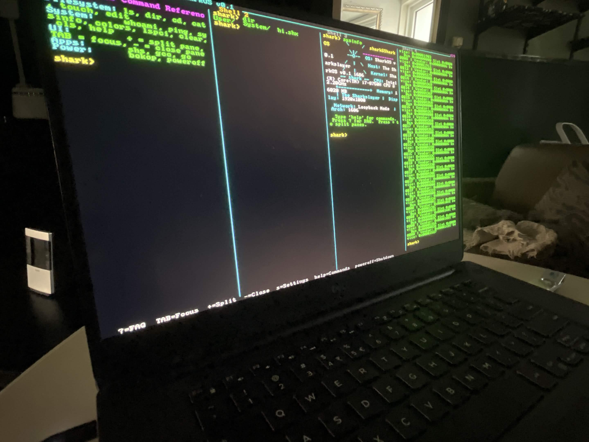
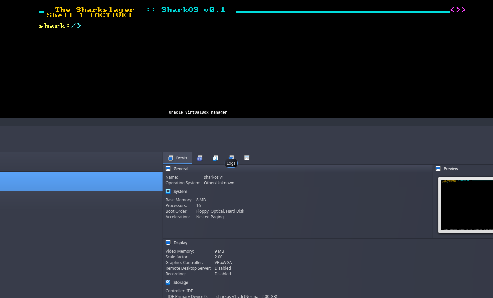
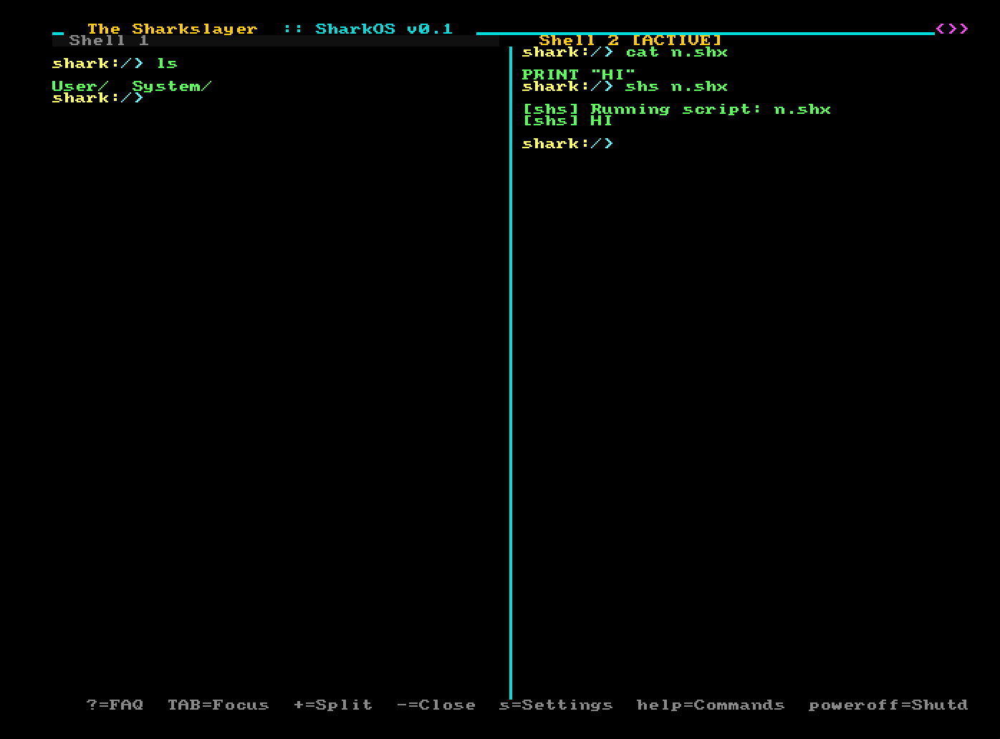

# SharkOS

A hobby 32-bit x86 operating system built from scratch in C, featuring a custom graphical shell, multi-pane terminal, in-memory filesystem, and ELF binary execution.

## Screenshots & Media

### Running on Real Hardware


**Boot on real hardware**  


### VirtualBox (8 MB RAM)


### SharkScript Compiler + Tiling


## Features

### Graphical User Interface
- **32-bit Linear Framebuffer** — boots directly into 32-bit color graphics mode via GRUB/VBE
- **Scalable Font Rendering** — 8×8 bitmap font scaled 1×–4× based on screen resolution
- **Multi-Pane Terminal** — split the screen into up to 8 independent panes with `+` / `-` keys
- **Pane Tabs** — each pane has a labeled tab bar; `TAB` cycles focus between panes
- **Chrome UI** — header bar with title, footer bar with keybind hints, border accents
- **FAQ Overlay** — press `?` to open a styled FAQ panel; `ESC` or `?` again to close

### Shell & Commands

| Command          | Description                                      |
|------------------|--------------------------------------------------|
| `ls` / `dir`     | List files and directories                       |
| `cd <dir>`       | Change directory (`cd ..` goes up)               |
| `cat <file>`     | Display file contents                            |
| `touch <file>`   | Create an empty file                             |
| `edit <file>`    | Built-in line editor (`ESC` to save & exit)      |
| `whoami`         | Print current user                               |
| `ping [host]`    | Send ICMP echo (RTL8139 or loopback)             |
| `sysinfo`        | Fastfetch-style system info panel                |
| `colors`         | Display 16-color VGA palette                     |
| `lspci`          | Scan and list PCI devices                        |
| `ps`             | List running tasks                               |
| `clear` / `cls`  | Clear active pane                                |
| `help`           | Show command reference                           |
| `bokop` / `poweroff` | Shut down the machine                        |

### Filesystem
- **In-Memory Tree FS** — 64-node pool, 16 children per directory
- **Pre-seeded structure**:
  ```
  /
  ├── User/
  │   ├── Documents/
  │   ├── Photos/
  │   └── readme.txt
  └── System/
      ├── Bin/
      │   └── shs          (SharkScript binary)
      ├── Drivers/
      └── Kernel.sys
  ```
- **ELF Execution** — load and run 32-bit ELF binaries from `System/Bin/`

### Hardware Support
- **RTL8139 NIC** — PCI detection, packet send, loopback ping
- **PS/2 Keyboard** — full scancode support with shift
- **CPUID** — brand string detection
- **Memory** — GRUB memory map parsing

### Kernel Internals
- Multiboot 1 compliant
- GDT/IDT + full ISR/IRQ handling
- PIC remapped to 32–47
- Bump allocator + basic task scheduler
- Syscalls via `INT 0x80`
- Cooperative multitasking

## Building

### Prerequisites
- `gcc` (i686-elf cross-compiler recommended)
- GNU assembler (`as`)
- `grub-mkrescue` + `xorriso`

### Build
```bash
make
```
Produces `sharkos.iso` (~40 MB).

### Run
```bash
qemu-system-i386 -cdrom sharkos.iso -m 512M
```

Or boot on real hardware / VirtualBox / Bochs.

### Clean
```bash
make clean
```

## Project Structure
```
sharkos/
├── Makefile
├── boot.s
├── linker.ld
├── grub.cfg
├── sharkscript          # Embedded SharkScript binary
├── include/
│   └── kernel.h
├── src/
│   ├── arch/
│   ├── drivers/
│   ├── fs/
│   ├── ui/
│   ├── shell/
│   └── lib/
└── isodir/
```

## Key Bindings

| Key       | Action                        |
|-----------|-------------------------------|
| `TAB`     | Cycle pane focus              |
| `+`       | Split pane horizontally       |
| `-`       | Close active pane             |
| `?`       | Toggle FAQ overlay            |
| `ESC`     | Close FAQ / Save & exit editor|
| `Enter`   | Execute command               |

## Design Notes
- No standard library (freestanding)
- Single address space
- Cooperative multitasking
- Static 8×8 bitmap font

## License
MIT — see [LICENSE](LICENSE) for details.

## Author
Built by **[mayshecry](https://github.com/mayshecry)**.
