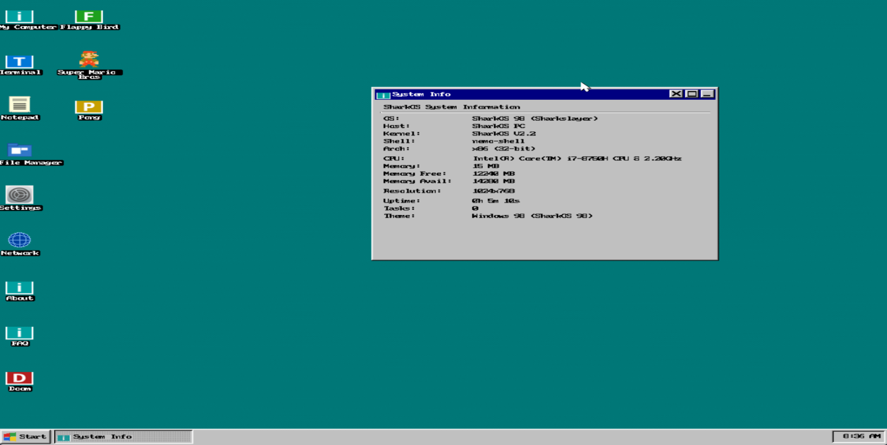
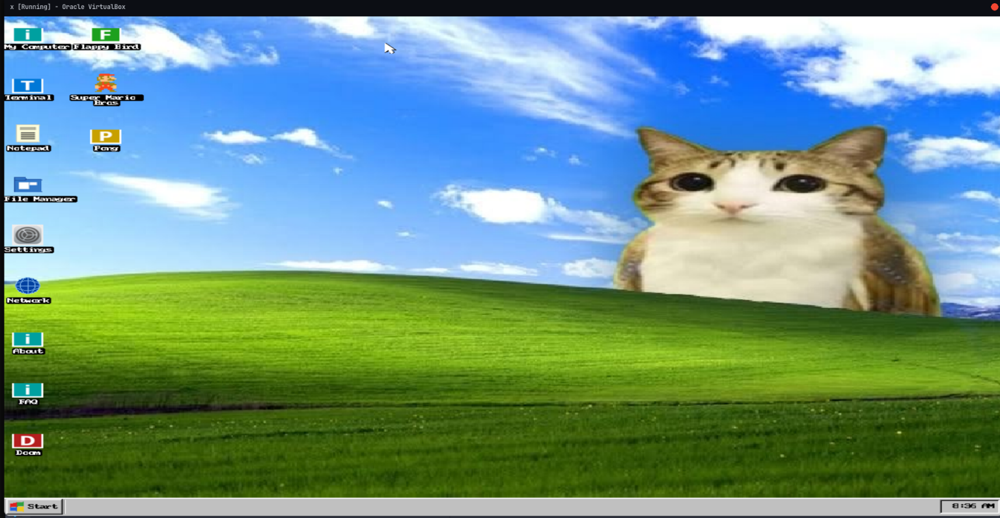

# SharkOS - The Original Shark running in Ring Zero

A hobby 32-bit x86 operating system built from scratch in freestanding C, now with a
Windows 98-style desktop environment: a real window manager with dragging, resizing,
z-ordering and a taskbar, a Start menu, desktop icons, bundled apps and games — plus
a TCP/IP stack, a plugin system and its own scripting language.

Version 2.2 "Sharkslayer" — kernel `SHKRNL`, shell `nemo-shell`.

## Screenshots

### The SharkOS 98 desktop
System Info and Notepad open over the classic teal desktop (dithered wallpaper, the
factory default):



### Bundled wallpaper
The Settings app can switch the desktop to the bundled image wallpaper:



### More media
- [Boot video on real hardware](media/hwdboot.mp4)
- [SharkOS running in VirtualBox with 8 MB of RAM](media/vbox.png)
- [Multi-pane tiling terminal (V1)](media/tilingonrealhardware.png)
- [SharkScript compiler](media/shs.png)

## ⚠️ Everything runs at Ring 0

SharkOS has **no userspace and no privilege separation**. There is a single privilege
level: every single thing you type into the terminal — `ls`, the games, the Python
interpreter, plugins, SharkScript programs, ELF binaries — **executes at Ring 0
(CPL 0) in kernel mode**, in the same address space as the kernel, with direct
access to all hardware and memory.

The `int 0x80` syscall interface exists only as a calling convention, **not** as a
security boundary. A typo in a command is a typo in the kernel. This is a deliberate
design choice that keeps the OS small and simple — and it means the shell can do
anything the kernel can do.

## Features

### Desktop environment ("SharkOS 98")
- **Win98 chrome everywhere** — beveled 3D surfaces, caption buttons, etched separators, teal desktop
- **Window manager** — up to 16 windows with drag, edge resize, focus, z-order, minimize / maximize / restore / close
- **Taskbar** — Start button, one button per open window (click to focus/minimize), system tray with a live RTC clock
- **Start menu** — apps, games, System Info, About, FAQ and Shut Down, with the vertical "SharkOS 98" gradient sidebar
- **Desktop icons** — Explorer-style column layout, single-click select, double-click (400 ms) to launch
- **Bundled wallpaper & icons** — 32×32 ARGB icons and a 736×460 wallpaper compiled into the kernel
- **Settings app** — wallpaper modes (teal dither / 8 solid colours / bundled image) and shutdown
- **Back-buffer compositing** — the whole desktop is composed in RAM and flushed to the framebuffer once per frame

### Bundled apps
| App | What it does |
|---|---|
| **Terminal** | The nemo-shell, running everything at Ring 0 (see above) |
| **System Info** | Fastfetch-style panel: OS, kernel, CPU, memory, uptime, tasks, theme |
| **Notepad** | Text editor with File/Edit/Search/Help menu strip |
| **File Manager** | Browse the in-memory filesystem |
| **Network** | NIC, MAC/IP configuration and link status |
| **Settings** | Wallpaper and shutdown |
| **About / FAQ** | Credits and answers |

### Games (windowed in the desktop)
- **Doom** — with a from-scratch BSP renderer
- **Flappy Bird**
- **Pong**
- **Super Mario Bros** — world 1-1
- **Geometry Dash**

### Terminal & shell
Over 90 built-in commands, all executing at Ring 0:

- **Filesystem**: `ls`, `cd`, `pwd`, `cat`, `tree`, `find`, `grep`, `stat`, `touch`, `mkdir`, `rm`, `mv`, `cp`, `edit`, `head`, `tail`, `wc`, `nl`, `sort`, `uniq`, `cut`, `tr`, `tee`, `rev`, `fold`, `expand`, `paste`, `join`, `comm`, `split`, `basename`, `dirname`, `realpath`, `ln`, `mktemp`
- **System**: `whoami`, `uname`, `sysinfo`, `neofetch`, `hostname`, `ps`, `htop`, `uptime`, `dmesg`, `log`, `env`, `id`, `umask`, `chmod`, `which`, `time`, `sleep`, `yes`, `seq`, `factor`, `printf`, `test`, `xargs`, `true`, `false`, `cal`, `who`
- **Network**: `ifconfig`, `dhcp`, `ping`, `wget`, `dns`, `netstat`
- **Fun**: `fortune`, `cowsay`, `sl`, `banner`, `guess`, `tictactoe`, `colors`, `spkg`
- **Power**: `poweroff`, `reboot`, `bokop`
- **Plugins**: `python`, `doom`, `flappybird`, `smb`, `pong`, `gdash` — plus any ELF binary placed in `System/Bin/`
- One easter egg: try `microsoft`. Don't say you weren't warned.

### Networking
A hand-rolled TCP/IP stack with two NIC drivers:
- **Drivers**: Realtek RTL8139 and AMD PCnet (I/O or MMIO), auto-detected via PCI
- **Protocols**: Ethernet, ARP, IPv4, ICMP, DHCP, UDP, DNS, TCP, HTTP `GET`
- **Commands**: `dhcp` (configure), `ping`, `dns <host>`, `wget <url>`, `ifconfig`, `netstat`
- Falls back to loopback when no NIC is present

### Plugin system
- **`spkg`** package manager — `spkg list`, `spkg install <name>`, `spkg uninstall <name>`
- **Automatic detection** — `.plg` files in `/System/plugins/` are discovered at boot, no hardcoded references
- **SharkAPI** — a WinAPI-style surface for plugin authors (console I/O, memory, strings, graphics, filesystem, tasks)
- **Built-in plugins**: Python interpreter (`python`, `python <file>`), Doom, Flappy Bird, Pong, Super Mario Bros, Geometry Dash
- See [PLUGIN_SYSTEM.md](PLUGIN_SYSTEM.md) and [PLUGIN_AUTO_DETECT.md](PLUGIN_AUTO_DETECT.md)

### SharkScript & ELF
- **SharkScript** (`shs`) — a custom scripting language with its own compiler, embedded into the ISO
- **ELF loader** — 32-bit ELF binaries in `System/Bin/` can be executed straight from the shell (yes — at Ring 0)

### Filesystem
- In-memory tree filesystem: 128-node pool, 8 children per directory, 2 KB per file
- Seeded at boot with `/sharkuser/` (Documents, Photos, readme.txt) and `/System/` (Bin, Drivers, Config, Logs, Modules, Proc, Security, Network, Plugins, Boot, Kernel.sys, boot.log, System.map)

### Boot modes (GRUB menu)
| Entry | What you get |
|---|---|
| **SharkOS** | Full SharkOS 98 desktop |
| **SharkOS Lite** | Lightweight console-only shell — no desktop, no mouse |
| **SharkOS Legacy** | Same lightweight console shell, legacy boot flavor |

## Kernel internals
- Multiboot 1 (GRUB), 32-bit linear framebuffer via VBE (up to 1920×1080@32bpp)
- GDT/IDT, full ISR/IRQ handling, PIC remapped to vectors 32–47
- PIT timer at 1000 Hz, PS/2 keyboard and mouse (interrupt-driven), RTC
- GRUB memory-map parsing, physical memory manager + bump allocator
- Task list with cooperative yielding, syscalls via `int 0x80`
- CPUID brand-string detection, PCI bus scan (`lspci`)
- Scalable 8×8 bitmap font (1×–4×) rendering
- **No libc, no stdlib — fully freestanding**, and no privilege levels: the kernel is everything

## Building

### Prerequisites
- `gcc` with 32-bit support (`gcc-multilib` on Debian/Ubuntu) — or an `i686-elf` cross-compiler
- GNU `as`
- `grub-mkrescue` (package `grub-pc-bin`) + `xorriso` + `mtools`

### Build & run
```bash
make                      # produces sharkos.iso (~12 MB)
qemu-system-i386 -cdrom sharkos.iso -m 512M
```

With networking:
```bash
qemu-system-i386 -cdrom sharkos.iso -m 512M \
    -netdev user,id=n0 -device rtl8139,netdev=n0
```
Then in the terminal: `dhcp`, `ping 10.0.2.2`, `wget http://…`

It also boots on real hardware (write the ISO to a USB stick) and in VirtualBox / Bochs.

### Clean
```bash
make clean
```

## Project structure
```
Shark-OS/
├── Makefile                # Build system
├── boot.s                  # 32-bit Multiboot entry (GDT, ISR/IRQ stubs)
├── linker.ld               # Linker script (kernel loaded at 1 MiB)
├── grub.cfg                # GRUB menu: SharkOS / Lite / Legacy
├── compiler.elf            # SharkScript compiler, embedded on the ISO
├── include/                # kernel.h, desktop.h, net.h, sharkapi.h, themes,
│                           # icon/wallpaper pixel data, game headers
├── src/
│   ├── arch/               # I/O, interrupts, CPU (CPUID)
│   ├── drivers/            # PS/2 keyboard & mouse, PCI, RTC
│   ├── net/                # RTL8139 + PCnet drivers, ARP/IP/ICMP/DHCP/DNS/TCP/HTTP
│   ├── fs/                 # In-memory tree filesystem
│   ├── desktop/            # Win98 desktop: bootscreen, window manager, taskbar,
│   │                       # start menu, icons, wallpaper, Notepad/File Manager/
│   │                       # Settings/Network/System Info app windows, PNG decoder
│   ├── ui/                 # Terminal core, chrome, mouse cursor, fastfetch
│   ├── shell/              # nemo-shell: commands, spkg, main, lite console
│   ├── lib/                # lib string/memory, PMM, ELF loader, SharkAPI,
│   │                       # plugin manager
│   ├── sharkscript/        # shs compiler
│   ├── doom/               # Doom + BSP renderer (rndr_*)
│   ├── flappybird/  pong/  smb/  geometrydash/
├── plugins/                # Plugin sources: TEMPLATE.c, doom, flappybird, pong,
│                           # smb, geometrydash, python-interp
├── pc/ icons/              # Asset sources (icons, wallpapers)
└── media/                  # Screenshots and videos
```

## Key bindings

| Input | Action |
|---|---|
| Left click / drag | Select icons, focus windows, drag title bars, resize edges |
| Double click | Launch a desktop icon |
| Start button | Open/close the Start menu |
| Taskbar buttons | Focus / minimize a window |
| `Ctrl+Tab` | Cycle window focus |
| `ESC` | Close info dialogs (About, FAQ, System Info) |
| Typing | Goes to the focused window (Terminal, Notepad, games) |

## Writing plugins

Quick example (see [PLUGIN_SYSTEM.md](PLUGIN_SYSTEM.md) for the full guide):

```c
#include "sharkapi.h"

plugin_info_t plugin_info = {
    .version = SHARKAPI_VERSION,
    .name = "My Plugin",
    .author = "Your Name",
    .description = "Does something useful",
    .major = 1,
    .minor = 0,
};

int plugin_init(void)      { sharkapi_println("Plugin loaded!"); return 0; }
void plugin_cleanup(void)  { sharkapi_println("Plugin unloaded"); }
int plugin_command(int argc, char** argv) {
    sharkapi_println("Hello from Ring 0!");
    return 0;
}

int plugin_init_entry(void) { return plugin_init(); }
void plugin_cleanup_entry(void) { plugin_cleanup(); }
int plugin_command_entry(int argc, char** argv) { return plugin_command(argc, argv); }
plugin_info_t* plugin_get_info(void) { return &plugin_info; }
```

Build it as a 32-bit ELF object, name it `yourplugin.plg`, drop it in
`/System/plugins/` and install it with `spkg install yourplugin`.

## Design notes
- **Freestanding** — no libc, no runtime; everything is hand-rolled
- **Single address space, Ring 0 only** — the shell, the apps, the games and the
  plugins are all kernel code; there is no userspace to escape from (or into)
- **Cooperative multitasking** — tasks yield voluntarily (`hlt`)
- **In-memory only** — the filesystem is volatile; nothing touches a disk
- **Non-destructive window painting** — the whole scene is recomposited each frame
  into a back buffer, then flushed once to the hardware framebuffer

## Troubleshooting
- **Build fails** — install `gcc-multilib`, `grub-pc-bin`, `xorriso` and `mtools`; run `make clean` before rebuilding
- **Garbled screen** — make sure the VM/emulator supports VBE linear framebuffers
- **No network** — pass `-netdev user,id=n0 -device rtl8139,netdev=n0` to QEMU and run `dhcp`
- **Plugins won't load** — plugins must be 32-bit ELF objects renamed to `.plg` in `/System/plugins/`

## Remixes & distros
You're allowed (and encouraged!) to build your own distro or remix of SharkOS —
fork it, retheme it, ship it. Just one ask: **send the dev a message with it**.
He loves looking at what the community builds with his OS.

## License
GPL-3.0 — see [LICENSE](LICENSE).

## Author
Built by **[mayshecry](https://github.com/mayshecry)**.

## Acknowledgments
- Inspired by [OSDev.org](https://wiki.osdev.org/) and the OS development community
- The Windows 98 aesthetic is used with affection
